# E-Commerce Customer Segmentation Engine

An end-to-end customer analytics pipeline built on a synthetic Indian e-commerce transactions dataset (~34,500 orders / 7,903 customers). The project moves from raw order data to RFM-based segmentation, unsupervised clustering, probabilistic Customer Lifetime Value (CLV) forecasting, and a marketing insights dashboard.

## Objective

E-commerce businesses can't treat every customer the same — a customer who orders every week is worth a very different retention strategy than one who bought once and vanished. The goal of this project is to build a data-driven engine that:

1. **Quantifies customer value and engagement** using Recency, Frequency, and Monetary (RFM) analysis.
2. **Segments customers** into actionable groups, both via rule-based RFM scoring and unsupervised K-Means clustering.
3. **Forecasts future value** for each customer using probabilistic CLV models (BG/NBD + Gamma-Gamma).
4. **Surfaces insights in a dashboard** so marketing teams can identify high-value, at-risk, and dormant customers and prioritize campaigns accordingly.

**Business outcome targeted:** improve marketing ROI by enabling personalized, tier-based campaigns — with a projected ~20% lift in conversion rate from better-targeted outreach.

## Project Structure

```
├── Raw Dataset/               # Original transaction-level data
├── data/                      # Cleaned / processed datasets used across notebooks
├── Images/                    # Exported charts
├── 1.Processing of Dataset.ipynb    # Cleaning, validation, feature prep
├── 2. Customer segmentation.ipynb   # RFM scoring + rule-based segments
├── 3. Customer Clustering.ipynb     # K-Means clustering + PCA
├── 4.CLV.ipynb                      # BG/NBD & Gamma-Gamma CLV modeling
└── 5.Dashboard.ipynb                # Plotly Dash marketing insights dashboard
```

**Modules covered:** RFM Analysis · Clustering Algorithms · Customer Lifetime Value (CLV) · Marketing Insights Dashboard

**Tech stack:** Python, pandas, numpy, scikit-learn (K-Means, PCA), `lifetimes` (BG/NBD, Gamma-Gamma), matplotlib/seaborn, Plotly Dash

---

## Phase 1 — Data Processing

The raw dataset spans Sep 2023 – Sep 2025 across 7 product categories and 5 regions.

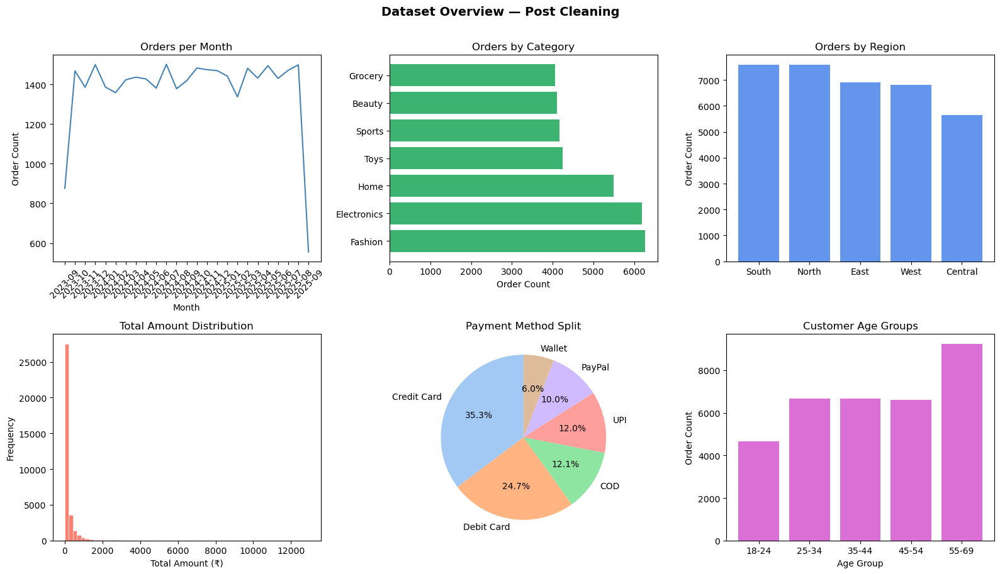

- **Order volume** is stable at ~1,350–1,500 orders/month, with a partial final month (data cutoff).
- **Category mix** is fairly balanced, led by Fashion and Electronics; Grocery and Beauty are the smallest.
- **Regional spread**: South and North lead order volume; Central lags.
- **Payment methods**: Credit Card (35.3%) and Debit Card (24.7%) dominate; digital wallets (UPI, COD, PayPal, Wallet) make up the remaining ~40%.
- **Age groups**: the 55–69 bracket is the single largest customer group — an important input for how campaigns should be targeted later.

## Phase 2 — RFM Analysis & Rule-Based Segmentation

Each customer was scored on **Recency** (days since last order), **Frequency** (order count), and **Monetary** (total spend) using quintile scoring (1 = worst, 5 = best).

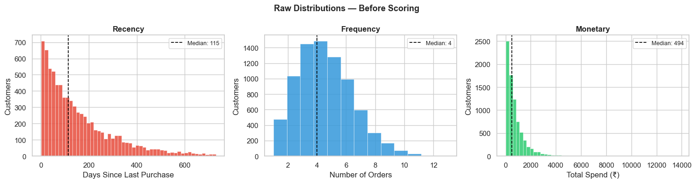
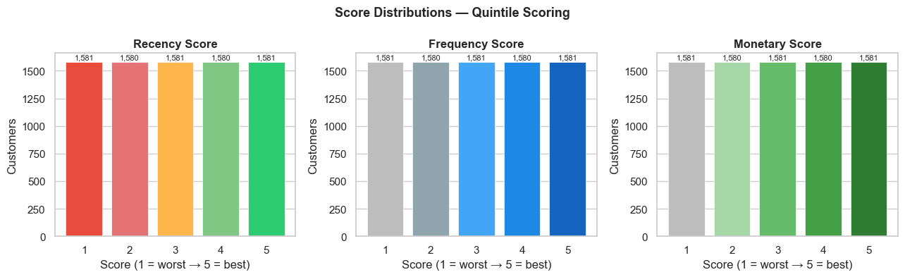

Median customer: last ordered **115 days ago**, with **4 orders** and **₹494** total spend — a highly right-skewed monetary distribution typical of e-commerce, where a small set of customers drive disproportionate revenue.

Combining R and F scores against average spend shows frequency, not recency, is the stronger driver of monetary value:

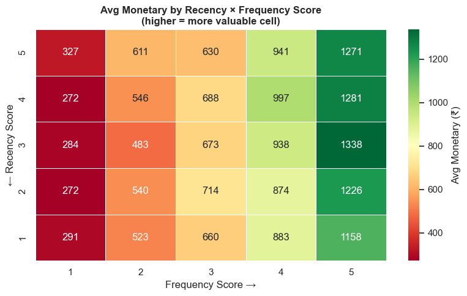

Customers were then mapped into 7 standard rule-based RFM segments (Champions, Loyal Customers, Potential Loyalists, Needs Attention, At Risk, Can't Lose Them, Hibernating):

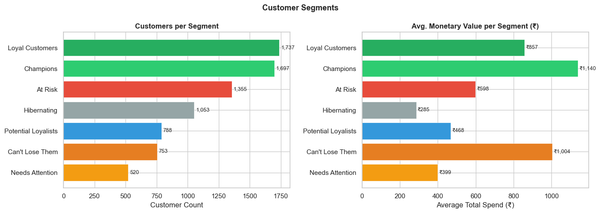
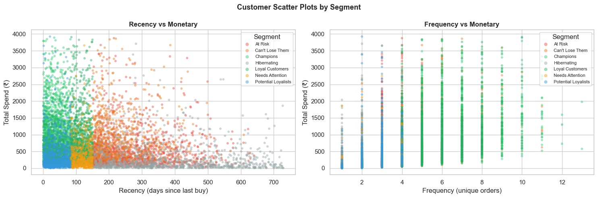

**Segment snapshot:**

| Segment | Customers | Avg. Spend (₹) |
|---|---|---|
| Loyal Customers | 1,737 | 857 |
| Champions | 1,697 | 1,140 |
| At Risk | 1,355 | 598 |
| Hibernating | 1,053 | 285 |
| Potential Loyalists | 788 | 468 |
| Can't Lose Them | 753 | 1,004 |
| Needs Attention | 520 | 399 |

**Can't Lose Them** stands out — a small group (753 customers) with the second-highest average spend (₹1,004), meaning they were once big spenders who have gone quiet. This is a high-priority win-back segment.

## Phase 3 — Customer Clustering (K-Means)

To validate the rule-based segments with an unsupervised approach, K-Means was applied to normalized RFM features.

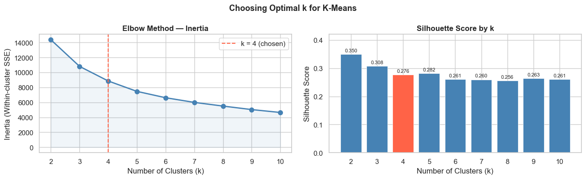

The elbow method flattens out and silhouette score technically peaks at k=2, but **k=4 was chosen** as the best trade-off between statistical separation and business interpretability — it produces distinct, actionable groups rather than an overly coarse split.

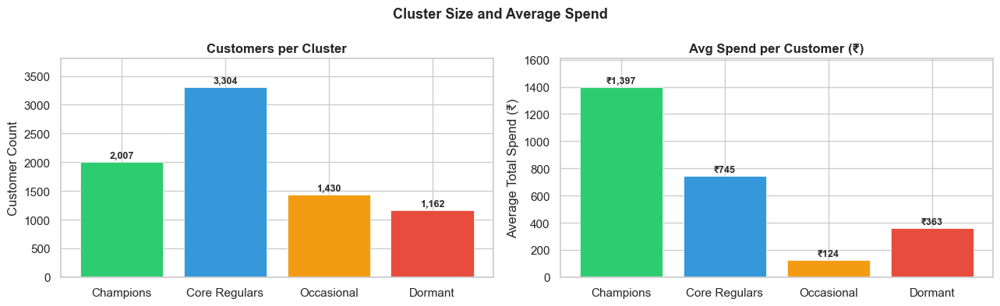
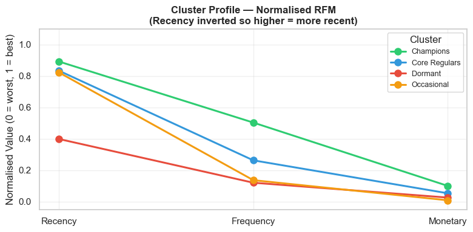

**4 behavioral clusters:**

| Cluster | Customers | Avg. Spend (₹) | Profile |
|---|---|---|---|
| Champions | 2,007 | 1,397 | Most recent, most frequent, highest spend |
| Core Regulars | 3,304 | 745 | Recently active, moderate frequency — the backbone of the customer base |
| Occasional | 1,430 | 124 | Recently acquired but low frequency/spend |
| Dormant | 1,162 | 363 | Long inactive, low engagement |

Projecting the clusters onto their top 2 principal components (86.9% of variance explained) shows clean, well-separated groupings:

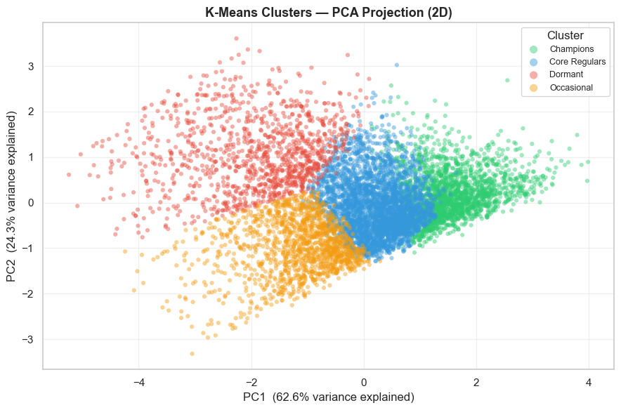

Comparing the K-Means clusters against the rule-based RFM segments confirms strong agreement (e.g. the Champions cluster is almost entirely rule-based Champions + Loyal Customers), while also revealing that "Core Regulars" absorbs customers spread across many rule-based labels — suggesting the rule-based segmentation may be **over-splitting** a fairly homogeneous middle group:

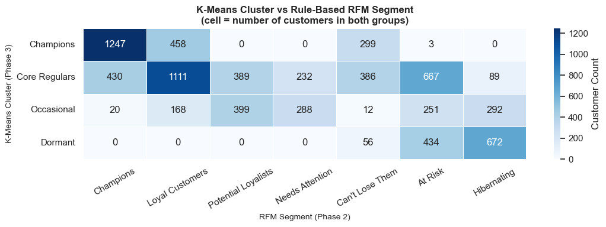

## Phase 4 — Customer Lifetime Value (CLV)

CLV was modeled probabilistically rather than via simple average-order-value extrapolation, using the **BG/NBD model** (predicts future purchase frequency) combined with the **Gamma-Gamma model** (predicts monetary value per transaction) — the standard non-contractual CLV approach used for e-commerce.

A key modeling assumption — that spend per order is independent of purchase frequency — was validated first:

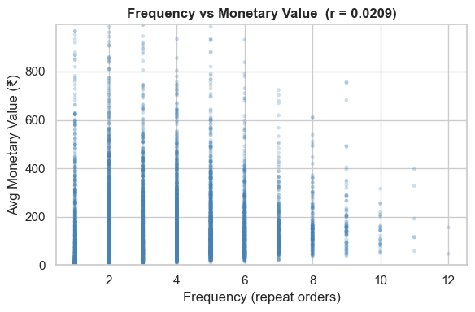

Correlation between frequency and average order value is essentially **zero (r = 0.021)**, confirming the two can be modeled independently, as the Gamma-Gamma model requires.

**BG/NBD — expected future purchases:**

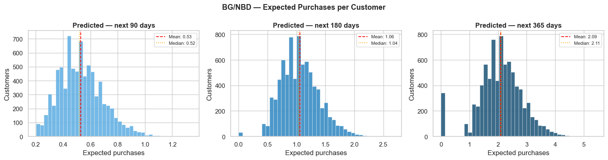

On average, a customer is expected to make **0.53 purchases in the next 90 days, 1.06 in 180 days, and 2.09 in 365 days** — with a distinct spike at zero, representing one-time buyers the model correctly identifies as unlikely to return.

**Resulting 180-day CLV distribution** is heavily right-skewed, as expected:

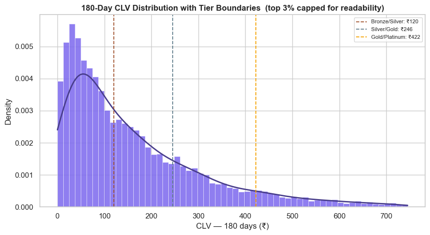

Customers were then bucketed into value tiers using CLV thresholds (Bronze < ₹120, Silver ₹120–246, Gold ₹246–422, Platinum > ₹422):

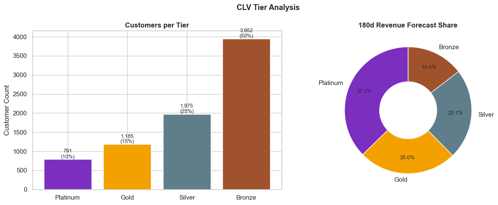

This is the project's clearest business insight: **Platinum customers are only 10% of the base but are forecast to generate 37.3% of revenue over the next 180 days** — a textbook Pareto pattern. Gold + Platinum together (25% of customers) account for over 62% of forecast revenue.

CLV also aligns well with the earlier RFM segments — Champions and Can't Lose Them post the highest median CLV, Hibernating the lowest:

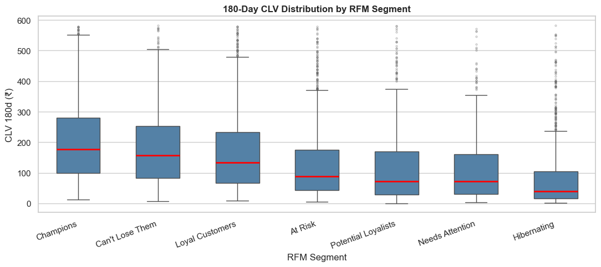

The top individually forecasted customers (all Platinum tier) range from ~₹1,600 to ~₹3,600 in projected 180-day value — natural candidates for VIP retention treatment:

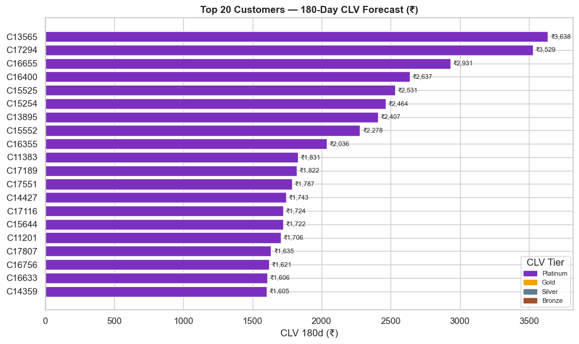

## Phase 5 — Marketing Insights Dashboard

A Plotly Dash dashboard consolidates RFM segments, cluster assignments, and CLV tiers into a single interactive view, allowing filtering by segment/tier and drill-down into individual customer profiles — built for a marketing team to act on without needing to touch the notebooks.

---

## Result Analysis

- **RFM and clustering agree on the extremes, disagree in the middle.** Champions and Dormant/Hibernating customers are identified consistently by both methods. The largest divergence is in the "regular" middle segment, where K-Means groups customers rule-based RFM splits into 4–5 separate labels — implying the rule-based thresholds may be more granular than the underlying behavior actually supports.
- **Frequency drives spend more than recency.** The RFM heatmap and the near-zero frequency–monetary correlation together show that *how often* a customer buys matters more to their value than *how recently* — useful for prioritizing frequency-boosting campaigns (e.g. subscribe-and-save, order reminders) over pure win-back timing.
- **Revenue is concentrated, not evenly spread.** The CLV tier analysis is the strongest business signal in the project: the top 10% of customers (Platinum) are projected to generate over a third of near-term revenue. Marketing spend should be weighted accordingly rather than distributed evenly across the base.
- **"Can't Lose Them" and Dormant/Hibernating customers represent the biggest at-risk value.** These were historically high spenders who have gone inactive — recoverable revenue that a generic "win-back" blast is unlikely to capture as effectively as a targeted, high-value-customer campaign.
- **One-time buyers are a real, sizable group.** The spike at zero in the BG/NBD forecast shows a meaningful share of customers are unlikely to purchase again at all — a segment better served by acquisition-style win-back offers than loyalty incentives.

## Conclusion

This project demonstrates a complete, statistically grounded customer analytics pipeline — from raw transactions to segment-level and individual-level revenue forecasts — without relying on arbitrary heuristics. Combining rule-based RFM (interpretable, fast to compute) with K-Means clustering (data-driven validation) and probabilistic CLV modeling (BG/NBD + Gamma-Gamma) gives a more complete picture than any single method alone: RFM explains *what* segment a customer is in today, clustering confirms *whether that grouping is statistically real*, and CLV predicts *what they're worth tomorrow*.

The practical payoff is a tiered customer base (Platinum/Gold/Silver/Bronze) ready to plug into targeted marketing: retention and loyalty perks for Platinum/Champions, frequency-driving nudges for Core Regulars, and win-back campaigns tailored specifically to the high-value-but-inactive "Can't Lose Them" group. This tiering directly supports the project's stated goal of improving marketing ROI through personalization, rather than one-size-fits-all campaigns.


### 🤝 Let's Connect!

Whether you want to discuss the SQL scripts in this repo, talk about remote work trends, or just say hi—my inbox is open!

* 💼 **LinkedIn:** [Connect with me on LinkedIn](https://www.linkedin.com/in/tarun-panigrahi-523534325)
* 🐙 **GitHub:** [Follow my latest projects](https://github.com/Rimuru259)
* 📧 **Gmail:** [Send me an email](mailto:tarunpanigrahi259@gmail.com)

